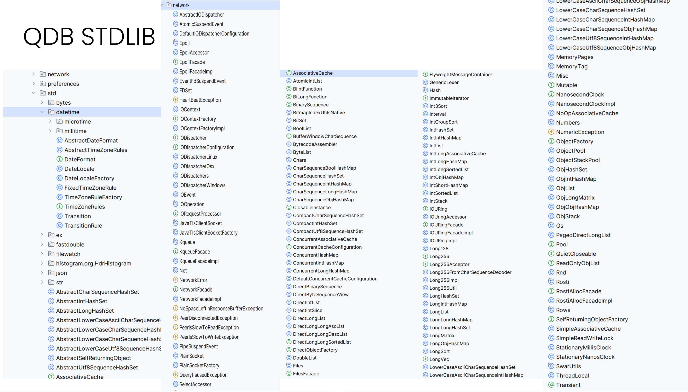
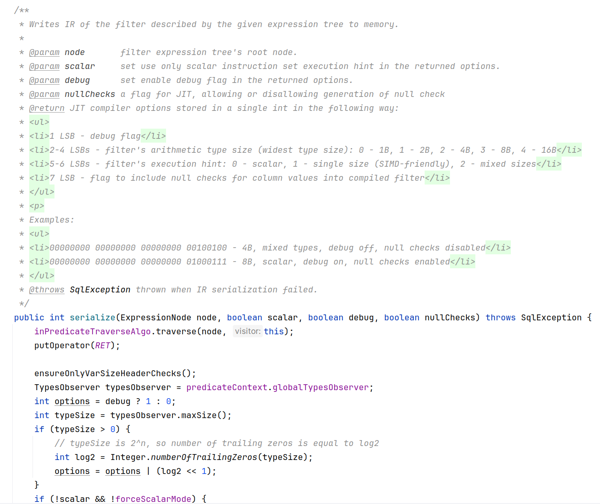
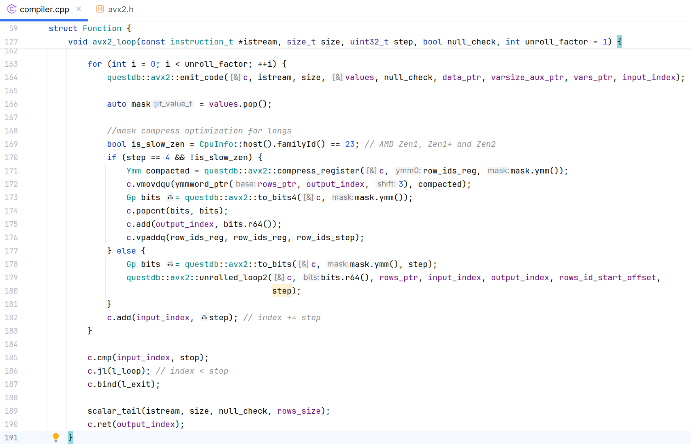
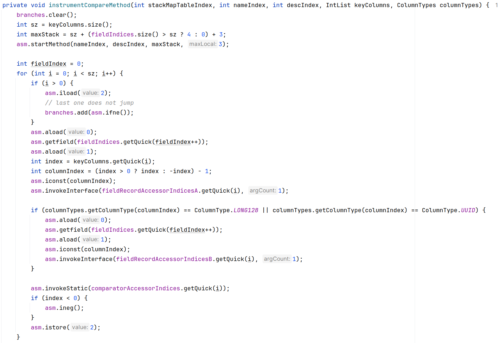

# Unorthodox Java: Building QuestDB
## High-Performance Time-Series Database

**Jaromir Hamala**
QuestDB Engineering Team


---

# About Me

- **Jaromir Hamala** - QuestDB Core Engineering Team
- Passion for concurrency, performance, and distributed systems
- Working on QuestDB

---

# What is QuestDB?

- **Open-source time-series database** (Apache License 2.0)
- SQL with time-series extensions
- PostgreSQL Wire Protocol compatible
- High-speed ingestion: InfluxDB line protocol
- Columnar storage format (native or Parquet)
- Partitioned and ordered by time

**GitHub:** https://github.com/questdb/questdb

---

# The Numbers 💪

## What do we mean by "high-performance"?

- **Millions** of rows ingested per second
- Query **billions** of rows efficiently
- Near-zero GC pauses

> No magic, just hard work and clever engineering

---

# Language Breakdown

<div class="columns">
<div>

## Implementation
- **90%** Java
- **10%** C/C++/Rust

</div>
<div>

## But... Unorthodox Java!
- In-house standard library
- Zero GC on hot path
- JNI when needed
- SIMD optimizations

</div>
</div>

---

# The Big Question

## Why Java at all?! 🤔

Let's explore why we chose Java and how we made it work for high-performance computing...

---

# Java is great! 

## It gives us

- **Community** - People who know it well
- **Tooling** - Excellent profilers, debuggers, IDEs
- **JIT Compiler** - Adaptive optimization at runtime 
- **Strong Type System** - Catches (some) bugs early
---

# But also:

```
commit 95b8095427c4e2c7814ad56d06b5fc65f6685130
Author: bluestreak01 <bluestreak@gmail.com>
Date:   Mon Apr 28 16:29:15 2014 -0700

    Initial commit
```

## **Rust 1.0**, was published on May 15, 2015

---
# QuestDB Design Principles

## Core Philosophy

1. **No Allocation on Hot-Path**
2. **Know your memory layout**
3. **Basic infrastructure MUST NOT allocate**
4. **No 3rd party Java libraries**

---
# Why Zero-GC?
## We have ZGC, Shenandoah, Azul C4 but...
- Concurrent collectors still cost CPU cycles
- And memory bandwidth
- And application throughput (barriers)

## The founder has a background in High Frequency Trading

---

# What This Led To...

- **Own standard library** - Replacement of Java's stdlib
- **C-like code patterns** - Direct memory management
- **Object pooling** - Fast single-threaded pools
- **Strategic JNI usage** - JNI is **NOT** slow!

---

# Frontend vs Backend Memory Strategy

<div class="columns">
<div>

## Frontend
- **Parser, Planner, Optimizer**
- Uses **Object Pooling**
- Temporary AST nodes
- Pure Java objects
- Fast allocation/deallocation

</div>
<div>

## Backend
- **Runtime, JIT, Storage**
- Uses **Off-heap Memory**
- Long-lived data
- Direct memory addresses
- Easy JNI communication

</div>
</div>

**Different parts, different strategies!**

---



---

# What Our Stdlib Provides

1. **I/O** - Network and file operations, including IO_URing
2. **Collections** - Specialized for primitives (no boxing!)
3. **Strings** - CharSequence-based, not String
4. **Numbers** - Fast parsing/printing


---
# Technique #1: Zero Allocation, Example #1

## Single-threaded pools
```java
// SqlParser uses object pool for AST nodes
ObjectPool<ExpressionNode> expressionNodePool;

// Acquire nodes during parsing
ExpressionNode node = expressionNodePool.next();
node.of(...);

// Mass release after plan creation
expressionNodePool.clear(); // O(1) - just reset position!
```

**Frontend optimization - parse without allocation**
**Demo: `SqlParser.parseTableName()`**

---


# Technique #1: Zero Allocation, Example #2

## Postgres Wire Protocol and `double` columns
## **DEMO** - `PGConnectionContext.appendRecord()`

---
# Technique #1: Zero Allocation, Example #3

IPv4 to String Conversion
```sql
SELECT ip_address, CAST(ip_address AS STRING) as ip_str
```

```java
// Traditional: Creates garbage for each row
public String getIPv4String(Record rec) {
    int ipv4 = arg.getIPv4(rec)
    String s = IPUtils.formatIPv4(ipv4); // New String per row!
    return s;
}

// QuestDB: Reusable StringSink
private final StringSink sinkA = new StringSink();
public CharSequence getStrA(Record rec) {
    sinkA.clear();  // Reset, don't allocate!
    Numbers.intToIPv4Sink(sinkA, arg.getIPv4(rec));
    return sinkA;
}
```

---

# Technique #2: Off-Heap Memory

Direct Memory Access
```java
// Allocate off-heap memory
long ptr = Unsafe.malloc(size);

// Direct memory operations
Unsafe.getUnsafe().putLong(ptr + offset, value);

// Manual memory management
Unsafe.free(ptr);
```

**Benefits:**
- No GC pressure
- Predictable memory layout
- Cache-friendly access patterns

---

# Memory-Mapped Files (mmap)

```java
// Map file directly into memory
long ptr = Files.mmap(fd, size, Files.MAP_RW);

// Read data directly from memory address
long value = Unsafe.getUnsafe().getLong(ptr + offset);

// Write data directly to memory address
Unsafe.getUnsafe().putLong(ptr + offset, newValue);

```
**Benefits:**
- **Zero-copy** - No data copying between kernel/userspace
- **Simple** - Kernel handles paging


---

# Flyweight Pattern with Off-heap

```java
public class FlyweightDirectUtf16Sink implements CharSequence {
    private long ptr;  // Start of memory region
    private long lo;   // Current position
    private long hi;   // End of memory region
    
    // Point to existing memory - no allocation!
    public FlyweightDirectUtf16Sink of(long start, long end) {
        this.ptr = start;
        this.lo = start;
        this.hi = end;
        return this;
    }
    
    // Direct memory access
    public char charAt(int index) {
        return Unsafe.getUnsafe().getChar(ptr + index * 2L);
    }
    
    [...]
}
```

**Key insight:** Same object, different memory regions!

---

## Offheap memory recap

- **No GC pressure** - Off-heap data is not tracked by the GC
- **Memory layout control** - Cache-friendly, predictable access
---

# What is SIMD? Single Instruction, Multiple Data

**Traditional (Scalar):**
```
a[0] + b[0] = c[0]  ← One operation
a[1] + b[1] = c[1]  ← One operation  
a[2] + b[2] = c[2]  ← One operation
a[3] + b[3] = c[3]  ← One operation
```

**SIMD (Vectorized):**
```
┌───────────────────┐   ┌───────────────────┐   ┌───────────────────┐
│a[0]│a[1]│a[2]│a[3]│ + │b[0]│b[1]│b[2]│b[3]│ = │c[0]│c[1]│c[2]│c[3]│
└───────────────────┘   └───────────────────┘   └───────────────────┘
               ↑ One instruction processes 4 values! ↑
```

**AVX2:** 256-bit registers = 8 ints or 4 doubles at once!
**AVX512:** 512-bit registers

---
# SIMD in Java I
```
JEP 338: Vector API (Incubator)
Authors	Vladimir Ivanov, Razvan Lupusoru, Paul Sandoz, Sandhya Viswanathan
Owner	Paul Sandoz
Type	Feature
Scope	JDK
Status	Closed / Delivered
Release	16
Component	hotspot / compiler
Discussion	panama dash dev at openjdk dot java dot net
Effort	M
Duration	M
Relates to	JEP 414: Vector API (Second Incubator)
Reviewed by	John Rose, Maurizio Cimadamore, Yang Zhang
Endorsed by	John Rose, Vladimir Kozlov
Created	2018/04/06 22:58
Updated	2021/08/28 00:15
Issue	8201271
```

---
# SIMD in Java II
```
JEP 508: Vector API (**Tenth** Incubator)
Owner	Ian Graves
Type	Feature
Scope	JDK
Status	Closed / Delivered
Release	25
Component	core-libs
Discussion	panama dash dev at openjdk dot org
Effort	XS
Duration	XS
Relates to	JEP 489: Vector API (Ninth Incubator)
Reviewed by	Jatin Bhateja, Sandhya Viswanathan, Vladimir Ivanov
Endorsed by	Paul Sandoz
Created	2025/03/31 18:19
Updated	2025/05/21 21:28
Issue	8353296
```
---


# Technique #3: Custom JIT with SIMD

## Not Java Vector API - Our Own JIT!

**Built with:**
- **asmjit** library for code generation
- C++ backend, Java frontend
- AVX2 instructions for vectorization
- Processes 8 rows simultaneously (256-bit registers)

**Example:** Filter on INT column processes 8 values at once

---

# Technique #4: Our Own JIT Compiler! 🚀

## SQL JIT Architecture

**Frontend (Java):**
- Analyzes filter suitability
- Serializes AST to IR

**Backend (C++):**
- Uses **asmjit** library
- Emits x86-64 machine code
- AVX2 vectorization
- 58 instructions for simple filters!

---



---



---

# JIT Performance Impact

## Real Query Example
```sql
SELECT * FROM trips 
WHERE total_amount > 150 
AND pickup_datetime IN ('2009-01')
```

**Single-thread scanning 13.5M rows (out of 1.6B total rows):**
- Without JIT: 150ms (hot run)
- With JIT: 35ms (hot run)
- **76% reduction** in execution time
- **3.3 GB/s** filtering rate
---

# Pre-JIT vs JIT Filtering

<div class="columns">
<div>

## Pre-JIT (Java)
- Operator function call tree
- Row-by-row processing
- Virtual method calls
- Interpreted execution

</div>
<div>

## With JIT
- Direct machine code
- Vectorized (8 rows at once)
- No virtual calls

</div>
</div>

**11K lines of code, 250+ commits to build it!**

---


# Technique #5: Runtime Bytecode Generation

## Custom Comparators for ORDER BY

```sql
SELECT * FROM readings 
ORDER BY sensor_id, batch_id DESC, timestamp
```

**Problem:** Generic comparator with virtual calls is slow!

**Solution:** Generate specialized bytecode at runtime

---

# Traditional Generic Comparator

```java
public int compare(Record a, Record b, int[] columns, int[] types) {
    for (int i = 0; i < columns.length; i++) {
        int col = Math.abs(columns[i]) - 1;
        boolean desc = columns[i] < 0;
        int cmp = 0;
        
        switch (types[col]) {
            case STRING:
                cmp = compareString(a.getStr(col), b.getStr(col));
                break;
            case LONG:
                cmp = Long.compare(a.getLong(col), b.getLong(col));
                break;
            case DOUBLE:
                cmp = Double.compare(a.getDouble(col), b.getDouble(col));
                break;
            // ... 20+ more types!
        }
        if (desc) cmp = -cmp;
        if (cmp != 0) return cmp;
    }
    return 0;
}
```

**Problems:** Type checking overhead, virtual calls, no optimization

---

# QuestDB: Runtime Bytecode Generation



---

# Generated Class Structure

```java
// Generated class for ORDER BY sensor_id, batch_id DESC, timestamp
public class GeneratedComparator implements RecordComparator {
    
    // Fields to cache left record values
    private int f0;    // sensor_id column
    private int f1;    // batch_id column  
    private long f2;   // timestamp column
    
    // Cache left record values
    public void setLeft(Record record) {
        this.f0 = record.getInt(0);
        this.f1 = record.getInt(1);
        this.f2 = record.getLong(2);
    }
    
    // Compare cached left with right record
    public int compare(Record right) {
        int cmp = Integer.compare(this.f0, right.getInt(0));
        if (cmp != 0) return cmp;
        cmp = -Integer.compare(this.f1, right.getInt(1)); // DESC!
        if (cmp != 0) return cmp;
        return Long.compare(this.f2, right.getLong(2));
    }
}
```

---
# QuestDB: Runtime Bytecode Generation


```java
// Generated at runtime for ORDER BY sensor_id, batch_id DESC, timestamp
public int compare(Record r) {
    int cmp = Integer.compare(this.f0, r.getInt(0));
    if (cmp != 0) return cmp;
    cmp = -Integer.compare(this.f1, r.getInt(1));
    if (cmp != 0) return cmp;
    return Long.compare(this.f2, r.getLong(2));
}
```

**RecordComparatorCompiler generates:**
- Custom class per query
- Type-specific comparison inlined
- No switches, no virtual calls, no boxing
- JVM can optimize this perfectly!

---

# Technique #6: Parallel GROUP BY Evolution

## The Journey to Scale

From single-threaded to massively parallel execution

---

# Single-threaded GROUP BY

```sql
SELECT sensor, max(temperature) FROM readings GROUP BY sensor
```

```
Input Data          Output Map
┌─────────┐        ┌──────────┐
│ NYC, 23 │───────►│ NYC: 23  │
│ SFO, 32 │        │ SFO: 32  │
│ NYC, 21 │        │          │
│ NYC, 22 │        │          │
│ ...     │        │ ...      │
│ Row N   │        └──────────┘
└─────────┘         
   ↓
Single Thread
```

**Problem:** Only uses one CPU core!

---

# Naive Parallel GROUP BY I

```
Input Data
┌─────────┐ worker1  ┌─────────┐
│Partition│─────────►│HashMap 1│
│   1     │          └─────────┘
├─────────┤ worker2  ┌─────────┐
│Partition│─────────►│HashMap 2│
│   2     │          └─────────┘
├─────────┤ worker3  ┌─────────┐
│Partition│─────────►│HashMap 3│
│   3     │          └─────────┘      
└─────────┘      
```


**Problem:** The same key is now in multiple maps!

---

# Naive Parallel GROUP BY II

```
Input Data
┌─────────┐ worker1  ┌─────────┐
│Partition│─────────►│HashMap 1│ \
│   1     │          └─────────┘  \
├─────────┤ worker2  ┌─────────┐   \   merge  ┌─────────┐
│Partition│─────────►│HashMap 2│    ──────────│  Result │
│   2     │          └─────────┘   /          └─────────┘
├─────────┤ worker3  ┌─────────┐  /     
│Partition│─────────►│HashMap 3│ /      
│   3     │          └─────────┘      
└─────────┘      
```


**Problem:** Merge becomes bottleneck with high cardinality!

---

# Solution: Sharded GROUP BY

```
Each worker creates multiple small maps (shards):

Thread 1          Thread 2         Thread 3
┌──────┐         ┌──────┐         ┌──────┐
│Shard0│         │Shard0│         │Shard0│
│Shard1│         │Shard1│         │Shard1│
│Shard2│         │Shard2│         │Shard2│
│Shard3│         │Shard3│         │Shard3│
└──────┘         └──────┘         └──────┘

Key → Shard: hash(key) & 3
```

**Key property:** Each key always maps to the same shard number!

---

# Sharded GROUP BY - Parallel Merge

```
Thread 1    Thread 2    Thread 3        Final Result
┌──────┐    ┌──────┐    ┌──────┐       ┌─────────┐
│Shard0│────│Shard0│────│Shard0│──────►│ Result0 │
└──────┘    └──────┘    └──────┘       └─────────┘
┌──────┐    ┌──────┐    ┌──────┐       ┌─────────┐
│Shard1│────│Shard1│────│Shard1│──────►│ Result1 │
└──────┘    └──────┘    └──────┘       └─────────┘
┌──────┐    ┌──────┐    ┌──────┐       ┌─────────┐
│Shard2│────│Shard2│────│Shard2│──────►│ Result2 │
└──────┘    └──────┘    └──────┘       └─────────┘
┌──────┐    ┌──────┐    ┌──────┐       ┌─────────┐
│Shard3│────│Shard3│────│Shard3│──────►│ Result3 │
└──────┘    └──────┘    └──────┘       └─────────┘
```

**4 parallel merges instead of 1!** No key appears in multiple results.
**Result:** No single-threaded bottleneck!

---

# Memory Layout Matters

## Row vs Columnar Storage

---

# Traditional Row Storage

```
┌─────────────────────────────────────────────┐
│ Row 1: [id=1, sensor='A', temp=23.5, ts=t1] │
├─────────────────────────────────────────────┤
│ Row 2: [id=2, sensor='B', temp=24.1, ts=t2] │
├─────────────────────────────────────────────┤
│ Row 3: [id=3, sensor='A', temp=23.8, ts=t3] │
├─────────────────────────────────────────────┤
│ Row 4: [id=4, sensor='C', temp=22.9, ts=t4] │
└─────────────────────────────────────────────┘
```

**Problem for analytics:**
- To read all temperatures, must skip over other fields
- Poor cache utilization
- Can't use SIMD effectively

---

# Columnar Storage

```
id column:     [1, 2, 3, 4, ...]
sensor column: ['A', 'B', 'A', 'C', ...]
temp column:   [23.5, 24.1, 23.8, 22.9, ...]
ts column:     [t1, t2, t3, t4, ...]
```

**Benefits:**
- Read only what you need
- Sequential memory access
- Cache-friendly
- SIMD operations on entire columns

---

# QuestDB's Secret: Time Ordering

```
Traditional Columnar (unordered):
temp: [24.1, 22.9, 23.5, 23.8, ...]  ← Random time order

QuestDB Columnar (time-ordered):
temp: [22.9, 23.5, 23.8, 24.1, ...]
       ↑                        ↑
    Oldest                  Newest
```

**Key Invariant:** All columns are **physically sorted by time**

---

# Why Time Ordering Matters

## Efficient Time Filtering
```sql
SELECT avg(temp) FROM sensors 
WHERE ts > now() - '1h'
```

- **Binary search** to find time range start
- Sequential read of recent data
- No index needed!

## Cache Locality
- Recent data (most queried) stays hot in cache
- Natural prefetching for sequential access

---

# JNI is NOT Slow!

## The Secret: Pass Primitives Only!

```java
// SLOW: Passing object references
native void processData(String[] data);  // Object refs = slow!

// FAST: Passing memory addresses
native void processData(long address, int length);  // Just primitives!
```

## Off-heap data enables fast JNI
- Direct memory addresses (long)
- No object references
- No GC coordination needed
- Zero marshalling overhead

**This is why we use off-heap memory!**

---

# Real-World Performance

## Full Table Scan Example
**1.6 billion rows** - All taxi trips data

```sql
SELECT * FROM trips 
WHERE total_amount > 150 
AND passenger_count = 1
```

**With JIT:** Significant speedup even on cold runs!
**Peak filtering rate:** 9.4 GB/s (single thread)

---

# Key Optimizations

1. **Specialized Hash Tables**
   - Fixed-size keys (32/64-bit)
   - No generic overhead
   
2. **Vectorized SQL Functions**
   - LIKE operator with SIMD
   - Parallel filters
   
3. **Custom Memory Allocators**
   - Arena allocation
   - Zero fragmentation

---

# Time-Series Specifics

## SAMPLE BY Query
```sql
SELECT timestamp, avg(temperature)
FROM sensors
WHERE device_id = 'sensor1'
SAMPLE BY 1h
```

## Optimized for:
- Time-ordered access
- Recent data queries
- High-cardinality aggregations

---

# Lessons Learned

1. **Java CAN be fast** - With the right approach
2. **Measure everything** - Benchmarks guide optimization
3. **Question conventions** - Standard library isn't sacred
4. **Hardware sympathy** - Know your CPU and memory
5. **Batch operations** - Amortize costs

---

# Why Java After All?

## The Good
- **Excellent tooling** - Profilers, debuggers, IDEs
- **Strong type system** - Catches bugs early
- **JIT compiler** - Adaptive optimization
- **Mature ecosystem** - Libraries for non-critical paths
- **Developer productivity** - Fast iteration

## The Trade-offs
- Required deep JVM knowledge
- Built our own infrastructure
- Careful coding discipline

---

# Community & Resources

## Get Involved!
- **GitHub:** https://github.com/questdb/questdb
- **Community:** Active contributors welcome
- **Use cases:** IoT, Finance, Monitoring, Analytics

## Learn More
- QuestDB documentation
- Performance blog posts
- Benchmark results

---

# Q&A

## Thank you! 🙏

**Jaromir Hamala**
QuestDB Core Engineering Team

### Questions?

- Specific optimization techniques?
- Architecture decisions?
- Performance measurements?
- Getting started with QuestDB?

---

# Bonus: Code Examples

## Want to try QuestDB?

```bash
# Docker
docker run -p 9000:9000 questdb/questdb
```

Visit: http://localhost:9000